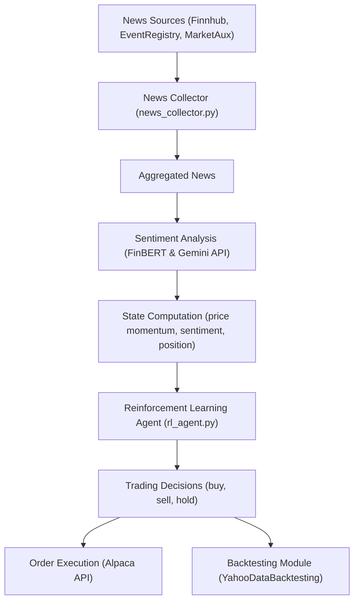

# MLTrader: A Machine Learning-Based Trading Bot

MLTrader is an automated trading system that integrates sentiment analysis and reinforcement learning to make market decisions. It aggregates news from multiple sources, estimates sentiment using both FinBERT and Google Gemini, and then employs a Deep Q-Network (DQN) agent to determine trade actions (buy, sell, or hold) on a specified market index. The bot can run in paper trading mode via Alpaca’s API and includes backtesting capabilities using Yahoo Finance historical data.

---

## Table of Contents

* [Overview](https://chatgpt.com/c/679f1ac7-9064-800c-8ffb-f5c831f8e726#overview)
* [Features](https://chatgpt.com/c/679f1ac7-9064-800c-8ffb-f5c831f8e726#features)
* [Architecture &amp; Data Flow](https://chatgpt.com/c/679f1ac7-9064-800c-8ffb-f5c831f8e726#architecture--data-flow)
* [Theory and Background](https://chatgpt.com/c/679f1ac7-9064-800c-8ffb-f5c831f8e726#theory-and-background)
* [Setup &amp; Installation](https://chatgpt.com/c/679f1ac7-9064-800c-8ffb-f5c831f8e726#setup--installation)
* [Configuration](https://chatgpt.com/c/679f1ac7-9064-800c-8ffb-f5c831f8e726#configuration)
* [Usage](https://chatgpt.com/c/679f1ac7-9064-800c-8ffb-f5c831f8e726#usage)
* [Project Structure](https://chatgpt.com/c/679f1ac7-9064-800c-8ffb-f5c831f8e726#project-structure)
* [References](https://chatgpt.com/c/679f1ac7-9064-800c-8ffb-f5c831f8e726#references)

---

## Overview

MLTrader uses a multi-step process to drive trading decisions:

1. **News Aggregation:** Collects headlines from Finnhub, EventRegistry, and MarketAux.
2. **Sentiment Analysis:** Uses FinBERT (via Hugging Face Transformers) and an enriched analysis through Google Gemini to assess market sentiment.
3. **Reinforcement Learning:** A DQN agent is trained on a state space defined by sentiment probabilities, sentiment labels, price momentum, and current position.
4. **Order Execution:** Trades are executed via the Alpaca API based on the RL agent's decisions.
5. **Backtesting:** Historical market data is used for simulating strategy performance using Yahoo Finance data.

---

## Features

* **News Aggregation:** Combines news from multiple APIs for a robust dataset.
* **Dual Sentiment Analysis:** Leverages both FinBERT and Google Gemini to ensure a balanced sentiment perspective.
* **Reinforcement Learning Agent:** Uses a Deep Q-Network (DQN) to dynamically adjust trading actions.
* **Paper Trading Mode:** Integrated with Alpaca’s paper trading endpoint for safe strategy testing.
* **Backtesting:** Evaluate strategy performance with historical market data.

---

## Architecture & Data Flow



---

## Theory and Background

### Sentiment Analysis

The project uses two methods for sentiment analysis:

* **FinBERT:** A financial domain-specific adaptation of BERT for sentiment classification. It processes news headlines with an exponential recency decay and source credibility weighting to provide a sentiment probability score. More details can be found in the [FinBERT documentation](https://huggingface.co/ProsusAI/finbert).
* **Google Gemini:** Provides enriched, human-like analysis by aggregating news headlines with timestamps, giving both a summary and a sentiment forecast. Explore more about generative AI models at [Google Generative AI](https://developers.generativeai.google/).

### Reinforcement Learning

The RL agent employs a Deep Q-Network (DQN) to learn an optimal trading policy. The state includes:

* Sentiment probability and sentiment label (encoded as numerical values).
* Price momentum calculated from price changes.
* Current position (long, short, or flat).

For an in-depth introduction to DQN and reinforcement learning in trading, see this [overview of deep reinforcement learning for trading](https://blog.mlq.ai/deep-reinforcement-learning-trading-strategies-automl/).

---

## Setup & Installation

### Prerequisites

* Python 3.8 or higher
* Git

### Create and Activate a Virtual Environment

#### Windows

```bash
python -m venv venv
venv\Scripts\activate
```

#### Linux / macOS

```bash
python -m venv venv
source venv/bin/activate
```

### Install Dependencies

Once the virtual environment is activated, install the required Python packages:

```bash
pip install -r requirements.txt
```

*Ensure your `requirements.txt` includes all the dependencies such as `torch`, `transformers`, `alpaca-trade-api`, `lumibot`, `google-generativeai`, `eventregistry`, etc.*

---

## Configuration

Create a `.env` file in the root directory of your project with the following content (replace the placeholder values with your actual API keys):

```ini
ALPACA_API_KEY = "YOUR_ALPACA_API_KEY"
ALPACA_API_SECRET = "YOUR_ALPACA_API_SECRET"
ALPACA_BASE_URL = "https://paper-api.alpaca.markets/v2"

FINNHUB_API_KEY = "YOUR_FINNHUB_API_KEY"
EVENTREGISTRY_API_KEY = "YOUR_EVENTREGISTRY_API_KEY"
MARKETAUX_KEY = "YOUR_MARKETAUX_KEY"

GEMINI_API_KEY = "YOUR_GEMINIAI_API_KEY"
GEMINI_API_URL = "https://api.google.com/gemini/generate"

# Specify the Indian market index to trade: options: "nifty50", "niftybank", "sensex"
MARKET_INDEX = "nifty50"
```

---

## Usage

### Running the Trading Bot

To start the trading bot in paper trading mode (or backtesting mode), simply run the `tradingbot.py` script:

```bash
python tradingbot.py
```

The script will:

* Load the environment variables from `.env`
* Backtest the strategy using Yahoo Finance data (for the dates specified)
* Log the trading decisions and sentiment analysis output

### Backtesting

The strategy uses the `YahooDataBacktesting` module from Lumibot to simulate trading using historical data. Modify the `start_date` and `end_date` variables in `tradingbot.py` as needed for your desired backtesting period.

---

## Project Structure

```
.
├── .env.example              # Example environment variable file
├── README.md                 # This file
├── requirements.txt          # Python package dependencies
├── chatgpt_client.py         # Gemini API integration for enriched sentiment analysis
├── news_collector.py         # Aggregates news from multiple sources
├── rl_agent.py               # DQN reinforcement learning agent
├── tradingbot.py             # Main trading bot integrating news, sentiment, and RL decision-making
└── utils.py                  # Utility functions for sentiment estimation using FinBERT
```

---

## References

* [FinBERT on Hugging Face](https://huggingface.co/ProsusAI/finbert)
* [Google Generative AI](https://developers.generativeai.google/)
* [Deep Reinforcement Learning for in Algorithmic Trading](https://blog.mlq.ai/deep-reinforcement-learning-trading-strategies-automl/)
* [Alpaca Trading API](https://alpaca.markets/docs/)
* [Lumibot Backtesting and Trading](https://github.com/lumibot/lumibot)
